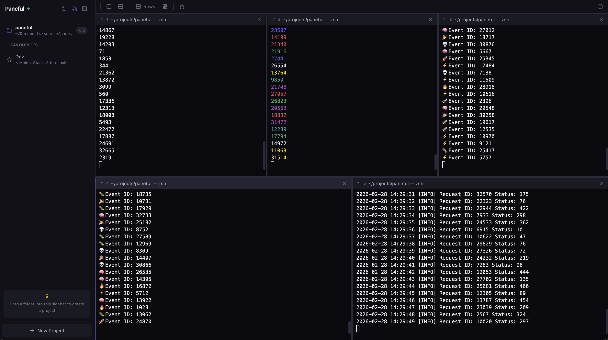

# Paneful

A terminal multiplexer that runs in your browser. Split panes, organize by project, drag and drop from Finder, sync with your editor — all from a single `npm install`.



## Install

```bash
npm i -g paneful
```

## Usage

```bash
paneful                        # Start server and open browser
paneful --port 8080            # Use a specific port
paneful --spawn                # Add current directory as a project
paneful --list                 # List all projects
paneful --kill my-project      # Kill a project by name
```

## Features

### Drag & Drop Projects

Drag a folder from Finder into the sidebar to create a new project with the path pre-filled.

### Drag Files into Terminals

Drag files from Finder or your editor (VS Code, Cursor) into a terminal pane to paste their paths as shell-escaped arguments.

### Favourites

Save a workspace layout as a favourite — name, layout preset, and per-pane commands. Launch any favourite with a click to instantly recreate the setup. Managed from the star icon in the toolbar and the favourites section in the sidebar.

### Editor Sync

Automatically switches the active project based on which editor window is in focus. Works with VS Code, Cursor, Zed, and Windsurf on macOS. Toggle via the monitor icon in the sidebar header.

Requires:
1. Terminal app added to **System Settings > Privacy & Security > Accessibility**
2. Editor window title includes the folder name (default in VS Code/Cursor)

### Resizable Sidebar

Drag the right edge of the sidebar to resize it. Width persists across sessions.

### Auto-Reorganize

Press `Cmd+R` or click the dashboard icon in the toolbar to automatically pick the best layout for your current pane count.

### Update Notifications

Paneful checks for newer versions on npm and shows a notification in the sidebar when an update is available.

## Keyboard Shortcuts

| Shortcut          | Action                          |
| ----------------- | ------------------------------- |
| `Cmd+N`           | New pane (vertical split)       |
| `Cmd+Shift+N`     | New pane (horizontal split)     |
| `Cmd+W`           | Close focused pane              |
| `Cmd+1-9`         | Focus pane by index             |
| `Cmd+Arrow`       | Move focus to adjacent pane     |
| `Cmd+Shift+Arrow` | Swap focused pane with adjacent |
| `Cmd+D`           | Toggle sidebar                  |
| `Cmd+T`           | Cycle through layout presets    |
| `Cmd+R`           | Auto reorganize panes           |

## Layout Presets

- **Columns** — side by side, equal widths
- **Rows** — stacked, equal heights
- **Main + Stack** — 60% left, rest stacked right
- **Main + Row** — 60% top, rest side by side bottom
- **Grid** — approximate square grid

## Development

```bash
npm install && cd web && pnpm install && cd ..

# Dev server (Vite frontend + Node.js backend, hot reload)
npm run dev

# Production build
npm run build

# Run locally
npm start
```

Vite dev server proxies `/ws` and `/api` to `localhost:3000`. Open `http://localhost:5173` or use Chrome in app mode for full keyboard shortcut support:

```bash
"/Applications/Google Chrome.app/Contents/MacOS/Google Chrome" --app=http://localhost:5173
```

## Architecture

- **Backend**: Node.js (Express + node-pty + ws)
- **Frontend**: React + TypeScript + xterm.js + Zustand + Tailwind CSS
- **Protocol**: JSON over a single WebSocket connection
- **Distribution**: npm package (`npx paneful`)

## Requirements

- Node.js 18+
- macOS or Linux
