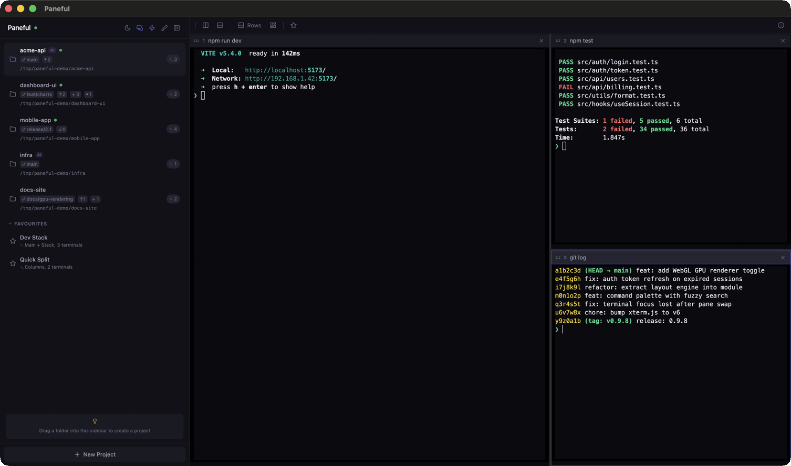

# Paneful

A fast, GPU-accelerated terminal multiplexer that runs in your browser — or as a native macOS app. Split panes, organize projects, sync with your editor, and detect AI agents and dev servers automatically. One `npm install`, no config.

**Website:** [paneful.dev](https://paneful.dev)



## Install

```bash
npm i -g paneful
```

## Usage

```bash
paneful                        # Start server and open browser
paneful --port 8080            # Use a specific port
paneful --spawn                # Add current directory as a project
paneful --list                 # List all projects
paneful --kill my-project      # Kill a project by name
paneful update                 # Update to the latest version
paneful --install-app          # Install as a native macOS app
```

## Features

### Split Pane Layouts

Five layout presets — columns, rows, main + stack, main + row, and grid. Cycle through them with `Cmd+T` or auto-reorganize with `Cmd+R`.

### Project Sidebar

Organize terminals by project. Each project gets its own layout, panes, and working directory. Switch instantly from the sidebar. Drag the right edge to resize — width persists across sessions.

### Drag & Drop

Drag folders from Finder into the sidebar to create projects with the path pre-filled. Drag files into terminal panes to paste their paths as shell-escaped arguments.

### Editor Sync

Automatically switches the active project based on which editor window is in focus. Works with VS Code, Cursor, Zed, and Windsurf on macOS. Toggle via the monitor icon in the sidebar header.

Requires:

1. **Paneful** (native app) or **Terminal** (CLI) added to **System Settings > Privacy & Security > Accessibility**
2. Editor window title includes the folder name (default in VS Code/Cursor)

### Favourites

Save a workspace layout as a favourite — name, layout preset, and per-pane commands. Launch any favourite with a click to instantly recreate the setup.

### GPU Rendering

Terminals render via WebGL2 on the GPU by default, which is significantly faster for high-throughput output and multiple panes. Toggle it from the sidebar header (lightning bolt icon) or the command palette. Falls back to the DOM renderer automatically if WebGL2 is unavailable or context is lost. The setting persists across sessions.

### Terminal Search

Press `Cmd+F` in any focused terminal to search its scrollback. Navigate matches with Enter / Shift+Enter or the up/down buttons. Press Escape to close.

### Command Palette

Press `Cmd+P` to open the command palette. Quickly switch projects, launch favourites, change layouts, or run any action — all from one fuzzy-searchable list.

### Git Branch Display

The sidebar shows the current Git branch next to each project's working directory as a small pill badge. Updates automatically every 10 seconds. Non-git directories show no badge.

### AI Agent Detection

Automatically detects when Claude Code or Codex CLI is running in a Paneful terminal. A purple **AI** badge appears next to the project name in the sidebar — pulsing when the agent is actively working, dimmed when idle. Disappears instantly when the agent exits. Uses zero filesystem access; detection is purely in-memory via the PTY process name and terminal output timestamps.

### Dev Server Detection

Automatically detects when a dev server starts in a terminal (Vite, Next.js, Angular, etc.). A green dot appears next to the project name in the sidebar while the port is alive, and disappears when it stops. Tracks ports per-terminal so the same port across different projects is handled correctly.

### Project Cleanup

Click the broom icon in the sidebar header to scan for projects whose directories no longer exist on disk. A confirmation modal shows matching projects before removing them.

### Auto-Reorganize

Press `Cmd+R` or click the dashboard icon in the toolbar to automatically pick the best layout for your current pane count.

### Native macOS App

Install Paneful as a standalone macOS app with its own Dock icon and window:

```bash
paneful --install-app
```

A folder picker dialog lets you choose the install location (defaults to `/Applications`). The app launches Paneful in a native WebKit window — no browser tab needed. Updating via `paneful update` automatically rebuilds the `.app` in place.

### VS Code Extension

Install the [Paneful extension](https://marketplace.visualstudio.com/items?itemName=kplates.paneful-vscode) from the VS Code Marketplace. Works with VS Code, Cursor, and other VS Code-based editors.

**Commands** (via Command Palette):

- **Paneful: Spawn project** — Creates or activates a Paneful project for the current workspace folder.
- **Paneful: Send open file paths** — Sends all open editor file paths to the focused Paneful terminal.

### Updating

```bash
paneful update
```

Checks npm for the latest version, installs it globally, and rebuilds the native `.app` if one is installed. The Dock icon stays valid automatically.

### Update Notifications

Paneful checks for newer versions on npm and shows a notification in the sidebar when an update is available.

## Keyboard Shortcuts

| Shortcut           | Action                          |
| ------------------ | ------------------------------- |
| `Cmd+P`            | Command palette                 |
| `Cmd+F`            | Search terminal scrollback      |
| `Cmd+N`            | New pane (vertical split)       |
| `Cmd+Shift+N`      | New pane (horizontal split)     |
| `Cmd+W`            | Close focused pane              |
| `Cmd+1-9`          | Focus pane by index             |
| `Cmd+Arrow`        | Line start / end in terminal    |
| `Ctrl+Shift+Arrow` | Move focus to adjacent pane     |
| `Shift+Arrow`      | Swap focused pane with adjacent |
| `Cmd+D`            | Toggle sidebar                  |
| `Cmd+T`            | Cycle through layout presets    |
| `Cmd+R`            | Auto reorganize panes           |

## Layout Presets

- **Columns** — side by side, equal widths
- **Rows** — stacked, equal heights
- **Main + Stack** — 60% left, rest stacked right
- **Main + Row** — 60% top, rest side by side bottom
- **Grid** — approximate square grid

## Development

```bash
npm install && cd web && pnpm install && cd ..

# Dev server (Vite frontend + Node.js backend, hot reload)
npm run dev

# Production build
npm run build

# Run locally
npm start
```

Vite dev server proxies `/ws` and `/api` to `localhost:3000`. Open `http://localhost:5173` or use Chrome in app mode for full keyboard shortcut support:

```bash
"/Applications/Google Chrome.app/Contents/MacOS/Google Chrome" --app=http://localhost:5173
```

## Architecture

- **Backend**: Node.js (Express + node-pty + ws)
- **Frontend**: React + TypeScript + xterm.js + Zustand + Tailwind CSS
- **Protocol**: JSON over a single WebSocket connection
- **Distribution**: npm package (`npx paneful`)

## Requirements

- Node.js 18+
- macOS or Linux
